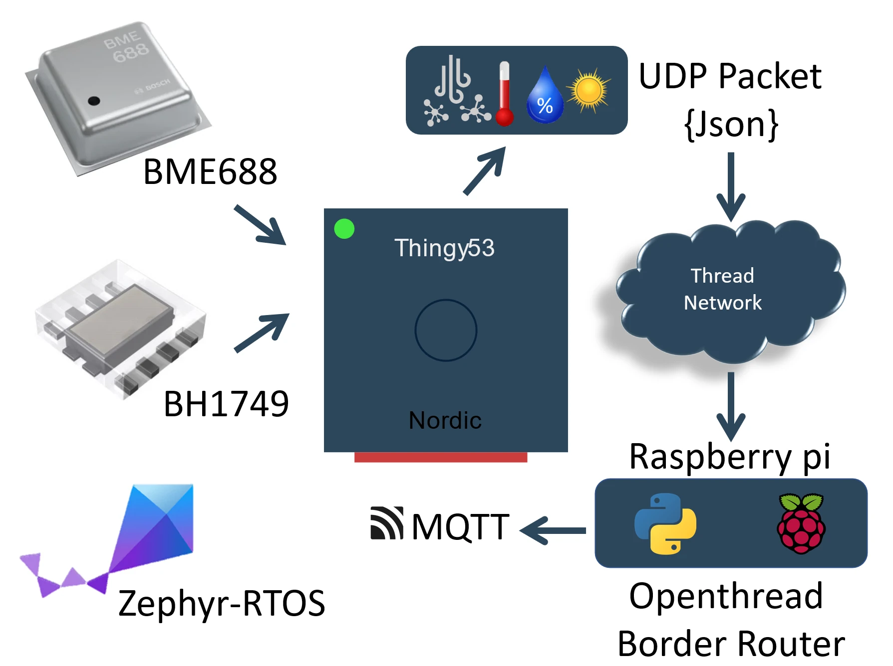
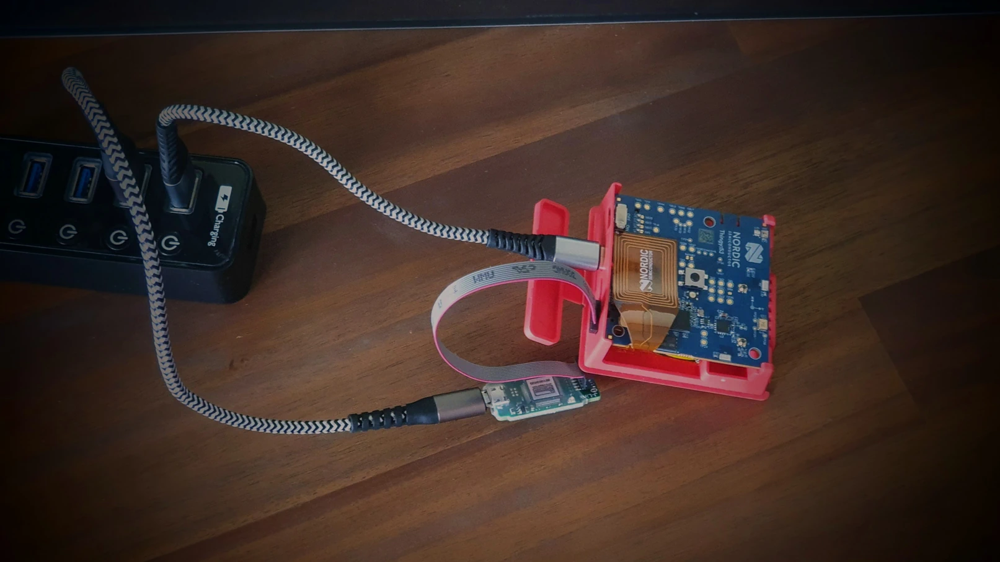
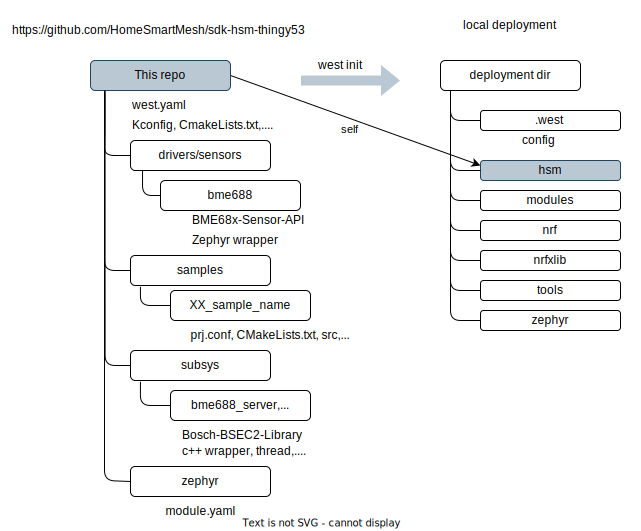
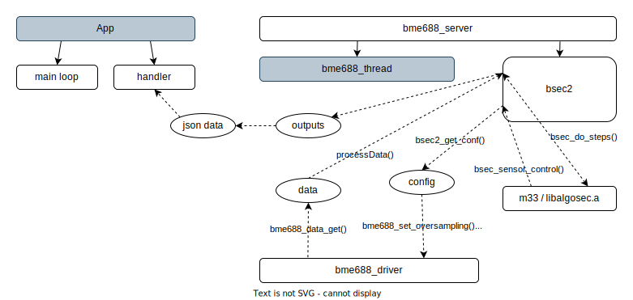

# Overview
Zephyr reference samples for Thingy53 dev kit, simple reference samples and sensors server
## Features
* Air quality with BME688 driver and library integrating Bosch's BSEC2 library for IAQ (Indoor Air Quality) measurements.
* Mesh Network with OpenThread broadcasting UDP packets as client and running a sensors server.
* C++ application with json inputs for config and outputs for sensors enables direct mapping to MQTT
* RGB Led, Light color, Battery



* Raspberry pi server repo : https://github.com/HomeSmartMesh/raspi

## Dev Kit
Below is an open box Nordic Thingy53 attached to USB and j-Link debugger


## Hardware
* Nordic's [Thingy53](https://www.nordicsemi.com/Products/Development-hardware/Nordic-Thingy-53) IoT Prototyping platform
* Segger's [j-Link Edu mini](https://www.segger.com/products/debug-probes/j-link/models/j-link-edu-mini/) (optional)

Used Sensors in this repo's samples
* BME688 Digital nose : low power gas, pressure, temperature & humidity sensor with AI
    * [BME688 Product page](https://www.bosch-sensortec.com/products/environmental-sensors/gas-sensors/bme688/)
    * [BME688 Datasheet](https://www.bosch-sensortec.com/media/boschsensortec/downloads/datasheets/bst-bme688-ds000.pdf)

* Color sensor BH1749NUC
    * [BH1749NUC Datasheet](https://fscdn.rohm.com/en/products/databook/datasheet/ic/sensor/light/bh1749nuc-e.pdf)
    * Measures Red, Green, Blue and IR
    * Illuminance Detection Range 80 klx (0.0125 lux/count)

## Repo structure


## Drivers and libraries
The following drivers and libraries have been created in this repo
* BME688 Zephyr Driver : in [drivers/sensor/bme688](drivers/sensor/bme688)
    * `BME68x-Sensor-API` vendor driver integration https://github.com/boschsensortec/BME68x-Sensor-API
    * Using Zephyr's Sensor API in C language for usage in BME688 simple forced mode
    * Driver extension functions to use BME688 in Parallel mode and get all x10 gas measures
* BME688 Server : in [subsys/bme688_server](subsys/bme688_server)
    * C++ wrapper to configure the BME688 usage in json structure (temperatures profile and durations)
    * handler delivers the sensor results in a json structure (temperature, humidity, pressure, gas-0..gas-9)
    * `Bosch-BSEC2-Library` .a vendor's binary integration for IAQ (Indoor Air Quality) measurements https://github.com/boschsensortec/Bosch-BSEC2-Library

BME688 Components and Data



## Usage
```bash
mkdir thingy53
cd thingy53
>west init -m https://github.com/HomeSmartMesh/sdk-hsm-thingy53 --mr main
>west update
```
building a sample
```bash
cd hsm/samples/20_sensors_server
west build
west build -- -DOVERLAY_CONFIG="overlay-logging.conf"
```
flashing
flashing using an attached debugger
```
>west flash
```

flashing manually
* connect to USB
* power on while holding SW2 down, see details on [updating thingy53 through USB](https://developer.nordicsemi.com/nRF_Connect_SDK/doc/latest/nrf/working_with_nrf/nrf53/thingy53_gs.html#updating-through-usb)
* with nRFConnect Programmer flash `hsm\samples\20_sensors_server\build\zephyr\dfu_application.zip`

Serial Port
* USB Serial Port : with the config `CONFIG_STDOUT_CONSOLE=y` this board creates a UAB virtual COM port of stdout. Note using the nRFSDK Connect Serial Terminal allows auto detection and reconnect of serial ports, very useful to recover automatically after flashing
* RTT Debugger Serial Port : using `CONFIG_USE_SEGGER_RTT=y` it is possible to have logs with the attached debugger and without using the board USB device, this needs rebuild the sample differently though.


# Samples details
for convenience and given that this repo is providing samples for `thingy53_nrf5340_cpuapp` board, it has been configured in the CMakeLists.txt to be taken as default board, it is still possbile to override it with -b option.
## 01_alive_counter_uart
[samples/01_alive_counter_uart](./samples/01_alive_counter_uart)

simplest program for checking UART with a live counter
## 02_rgb_led
[samples/02_rgb_led](./samples/02_rgb_led)

controlling the colors of the Red Green and Blue LEDs with pwm
* function for setting x3 float colors
* function for blinking a color

## 03_battery
[samples/03_battery](./samples/03_battery)

* Power Management Integrated Circuit specification [nPM1100_PS_v1.3.pdf](https://infocenter.nordicsemi.com/pdf/nPM1100_PS_v1.3.pdf)
* Thingy53 schematics `PCA20053_Schematic_And_PCB.pdf`

used pios
* Battery Measure ENABLE P0.16 `vbatt.power-gpio` in `thingy53_nrf5340_common.dts`
* Battery Measure BAT_MEAS P0.06/AIN2 `vbatt.io-channels` in `thingy53_nrf5340_common.dts`
* Battery charging Indicator CHG PMIC_STATUS P1.00 `battery-charge-gpios` in `app.overlay`

## 04_bme680
[samples/04_bme680](./samples/04_bme680)

    Note : Do not use this sample, it is for info only, using BME680 driver for BME688 can only fetch temp,hum,press but not gas due to difference in registers config

* this sample is based on [BME680 Zephyr sample](https://docs.zephyrproject.org/latest/samples/sensor/bme680/README.html) from Nordic's fork [nRF BME680 Zephyr sample](https://developer.nordicsemi.com/nRF_Connect_SDK/doc/latest/zephyr/samples/sensor/bme680/README.html)
* this samples uses the device drivers declaration `bosch,bme680` in the thingy53 dts file `thingy53_nrf5340_common.dts` used for
    * Temperature
    * Air pressure
    * Humidity

## 05_bme688
[samples/05_bme688](./samples/05_bme688)

* sample demonstrating the usage of the BME688 C driver wrapper over Zephyr's sensor API and using Bosch's `BME68x-Sensor-API`
* config flag `CONFIG_BME688=y`

Output
```shell
del_period = 142590
Temperature(deg C), Pressure(Pa), Humidity(%), Gas resistance(ohm)
25.24, 95917.63, 40.48, 23992.50
new data , no Gas Index , Gas Meas Valid , Heat Stability
```

references
* Nordic DevZone Forum : https://devzone.nordicsemi.com/f/nordic-q-a/98569/gas-resistance-values-from-bme688-on-thingy-53

## 06_bme688_parallel
[samples/06_bme688_parallel](./samples/06_bme688_parallel)

* introducing usage additional custom functions to enable usage of BME688 in prallel mode still in C language
* config flag `CONFIG_BME688=y`
* `bme688_set_mode_default_conf()`
* `bme688_data_get()`

## 07_bme688_parallel_cpp
[samples/07_bme688_parallel_cpp](./samples/07_bme688_parallel_cpp)

* a C++ wrapper for bme688_server library
* config flags `CONFIG_BME688=y` and `CONFIG_BME688_SERVER=y`
* `set_bme688_config()` with temperatures and durations in a json structure
* `start_bme688()` with a handler that gets a json structure with temperature, humidity, pressure, gas-0..gas-9

## 08_bme688_bsec2
[samples/08_bme688_bsec2](./samples/08_bme688_bsec2)

* Enables the BSEC2 part of the bme688_server library, `Bosch-BSEC2-Library` .a vendor's binary integration for IAQ (Indoor Air Quality) measurements https://github.com/boschsensortec/Bosch-BSEC2-Library
* new flag `CONFIG_BME688_BSEC2=y` in addition to `CONFIG_BME688=y` and `CONFIG_BME688_SERVER=y`
* returns `iaq`, `iaq_accuracy`, `co2_eq`, `breath_voc`, `stabilization` and `runin` calculated from the bsec2 library


## 09_bh1749
[samples/09_bh1749](./samples/09_bh1749)

* Color sensor BH1749NUC
    * [BH1749NUC Datasheet](https://fscdn.rohm.com/en/products/databook/datasheet/ic/sensor/light/bh1749nuc-e.pdf)
    * Measures Red, Green, Blue and IR
    * Illuminance Detection Range 80 klx (0.0125 lux/count)


## 11_openthread_shell
[samples/11_openthread_shell](./samples/11_openthread_shell)


* provides a shell on the USB UART interface that allows to manually configure the openthread stack

build
```shell
cd thingy53/hsm/samples/11_openthread_shell
>west build
```

## 12_ot_udp_client
[samples/12_ot_udp_client](./samples/12_ot_udp_client)

* using a fixed openthread network config allows to hard-code network credentials for testing only (not suited for deployment), even when used for local deployments it is unpractical as the device needs to be flashed everytime the network parameters change
* loops sending alive counter messages as thread udp packets
* `overlay-logging.conf` uses RTT and USB log for openthread state and loop count

build options
```shell
>west build
>west build -- -DOVERLAY_CONFIG="overlay-logging.conf"
```

## 13_ot_joiner
[samples/13_ot_joiner](./samples/13_ot_joiner)

* Commissioning with a joiner PSKd (Pre-Shared Key for the Device) `ABCDE2`
    * needs the commissioner to be ready for this device
* short SW2 button press < 1 sec : soft reset `SYS_REBOOT_WARM`
    * will retry joining if not attached
* long SW2 button press > 1 sec : OpenThread Farctory reset (delete credentials) and `SYS_REBOOT_COLD`
    * will try joining a new network
* `overlay-logging.conf` uses RTT and USB log and prints the following on startup
    * Joiner `eui64`
    * Joiner `pskd` built with in the provided config
    * the qrcode text containing the `eui64` and `pskd` as parameters
    * a url to a generated qrcode image to be used for joining
* loops sending alive counter messages as thread udp packets

build options
```shell
>west build
>west build -- -DOVERLAY_CONFIG="overlay-logging.conf"
```

Note on joining:
* the `eui64` can be known by first flashing the logging version with `overlay-logging.conf`
* without knowing the `eui64` it is also possible to commission with '*' as `eui64` parameter

## 14_ot_udp_echo_server
[samples/14_ot_udp_echo_server](./samples/14_ot_udp_echo_server)

* OpenThread broadcasts udp packet
* separate `udp_rx_handler` thread
* binds to port 4242 and echoes back received characters (printed as text)

## 15_udp_json_endpoint
[samples/15_udp_json_endpoint](./samples/15_udp_json_endpoint)

* OpenThread server endpoint can receive json commands and send back responses


## 20_sensors_server
[samples/20_sensors_server](./samples/20_sensors_server)

* OpenThread Joiner device
* OpenThread mesh client broadcasts udp json packet with Voltage, Alive counter, Charging status, ambient light RGB IR, Temperature, pressure, humidity and Indoor Air Quality
* OpenThread server endpoint can receive json commands and send back responses

on rasp
```shell
>sudo ot-ctl
udp open
udp send ff02::1 4242 hi_there_now
```

# Plan
* MQTT publish sample
* reliable ot tx rx, e.g. tcp, websocket, session,... for packet request response
* Python MQTT Translator for request response with json bodies
* RGB Led notification service
* sensors json logger service (configurable sensors and rates)
* ot lifecycle, if not connected, restart after timeout, which will retry join
* system lifecycle, watchdog restart
* power measurements
* microhpone streaming
* microphone local

# Deveopment guide
This repository is a [Zephyr workspace application](https://developer.nordicsemi.com/nRF_Connect_SDK/doc/latest/zephyr/develop/application/index.html#zephyr-workspace-application) that contains the samples source code only therefore lightweight to clone and manage, yet it tracks an exact reference of all dependencies that get deployed once initialized with `west init`

## Hints and Tricks
* k_sleep in interrupt functions might lead to os crash, usage of LOG effect unclear so to be avoided
* Fifo, Lifo, Queue take pointers only, user allocates the data but there's also `k_fifo_alloc_put`
* Message Queues copy the data provided in a ring buffer, (overwrite oldest)
* Work queues are used to delay functions execution or order multiple functions execution


## How was this repo created
* step one is to get familiar with Zephyr a good reference is https://developer.nordicsemi.com/nRF_Connect_SDK/doc/latest/zephyr/develop/index.html
* second is to focus on the subsection for west https://developer.nordicsemi.com/nRF_Connect_SDK/doc/latest/zephyr/develop/west/index.html

This repository is targetting an nRF dev kit, thereforeit is safer to derive it from nRF's fork of Zephyr and other dependencies. the steps are :
* west.yml dependencies taken from https://github.com/nrfconnect/sdk-nrf/blob/main/west.yml
* the default remote is hsm instead of ncs, therefore in the `projects:` the remote ncs needs to be added where applicable
* in the application `zephyr`, the `name-allowlist` helps reduce the dependencies from Zephyr
* note also some Zephyr dependencies can be replaced with top level projects such as mbedtls which is then taken from nRF fork and not from Zephyr
* in case of Kconfig wanrings, it is necessary to compare with the original repo (ncs/nrf) and find the directory (dependency) where that flag is used e.g. missing config for `NRF_MODEM_LIB_SHMEM_CTRL_SIZE` which default is `NRF_MODEM_SHMEM_CTRL_SIZE` defined in `nrfxlib\nrf_modem\Kconfig` that shows a dependency from `nrfconnect/nrf` to `nrfconnect/nrfxlib`

## Zephyr references
* Kernel services : https://docs.zephyrproject.org/latest/kernel/services/index.html

## Project references
* https://www.hackster.io/wassimfilali/indoor-air-quality-with-thingy53-and-bme688-5c763b
* https://devzone.nordicsemi.com/f/nordic-q-a/98569/gas-resistance-values-from-bme688-on-thingy-53
* https://devzone.nordicsemi.com/f/nordic-q-a/92593/using-bsec-2-library-for-bme688-with-thingy53
* https://community.bosch-sensortec.com/t5/MEMS-sensors-forum/How-to-convert-gas-res-to-AIQ-in-thingy53/m-p/67211/highlight/false#M13176
* https://www.hackster.io/mahmood-ul-hassan/how-to-read-nordic-thingy-53-onboard-bme688-sensor-003560
* https://community.bosch-sensortec.com/t5/MEMS-sensors-forum/IAQ-from-BME688-on-NRF9160-ZephyrRTOS/m-p/50953
